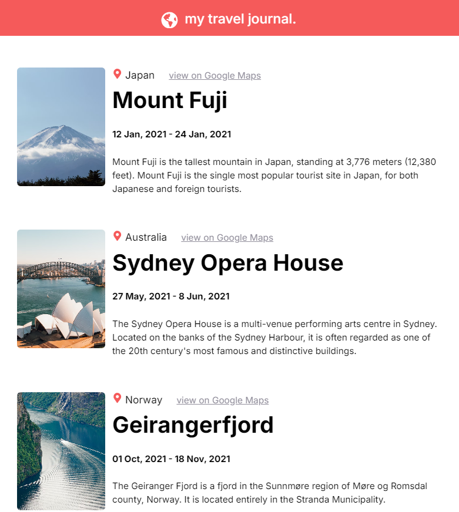

My second react project without tutorial and copy paste :)
I build this project from scratch, setting up react environment with my own research.
Although this just a simple project but this project help me learn how data driven in reactjs, and this also keep me praticing html and css 
------------------------------------------------------------------------------------

